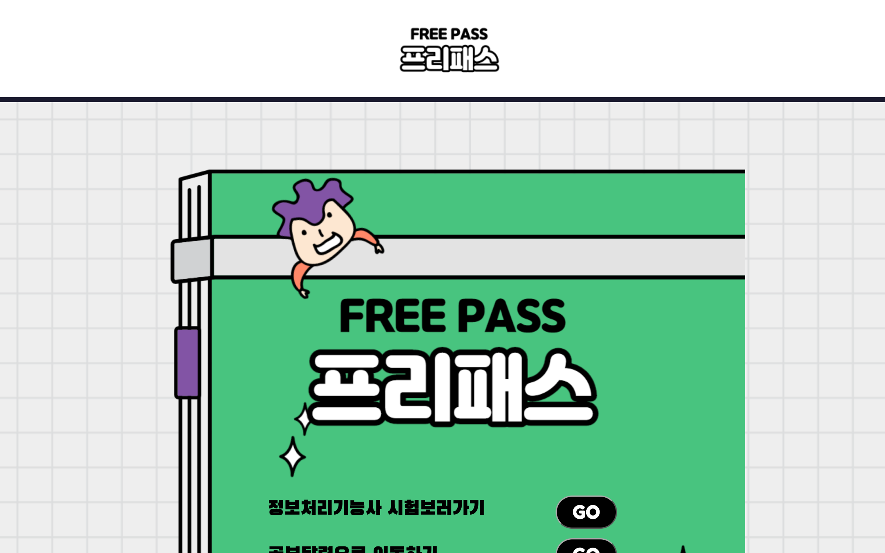

# 프리패스 (FreePass)

**정보처리기능사 필기 시험을 연습할 수 있는 웹입니다.**

기출문제를 풀어보고, 시험까지 남은 일정을 달력으로 관리할 수 있게 만들었습니다. 자격증을 준비하면서 "문제 풀이와 일정 확인을 한곳에서 하고 싶다"는 생각으로 시작했습니다.

## 화면

| 파일 | 화면 |
| :--- | :--- |
| `FreePass-Main.html` | 메인 |
| `FreePass-Blurb.html` | 소개 |
| `FreePass-Calendar.html` | 시험 일정 달력 |
| `FreePass-Final.html` | 문제 풀이 |

달력은 [FullCalendar](https://fullcalendar.io/) 5.4.0을 사용했습니다. 동작 로직은 `FreePass.js`에 있습니다.

## 실행

`FreePass-Main.html`을 브라우저로 엽니다. 빌드 과정이 없는 정적 페이지입니다.

`HTML` `CSS` `JavaScript` `FullCalendar`

---

> 웹 기초를 익히며 만든 학습용 저장소입니다.
